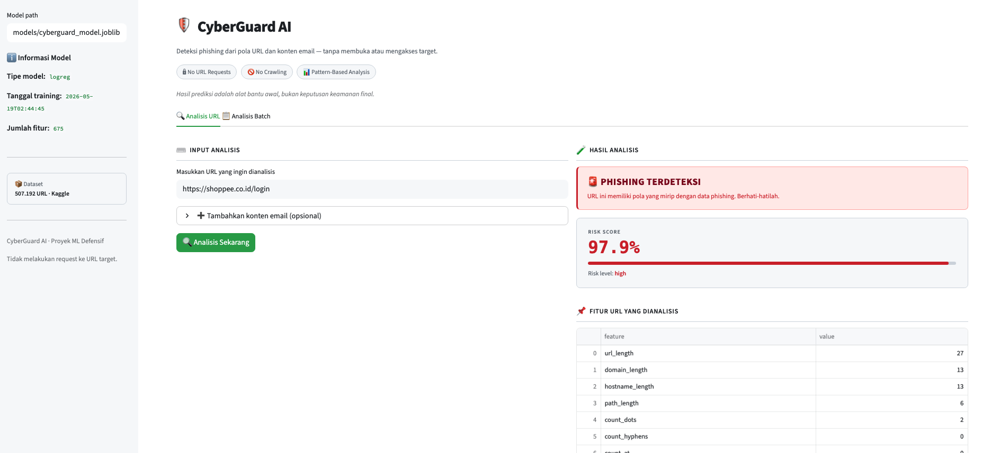

# CyberGuard AI

**CyberGuard AI** adalah sistem machine learning defensif untuk membantu mengklasifikasikan URL dan konten email sebagai legitimate atau berisiko phishing. Proyek ini menganalisis pola URL, sinyal typosquatting, dan teks email tanpa membuka atau mengakses URL target.

[](https://cyberguard-ai-eqssmzk9t8p5wkn93yg6yr.streamlit.app/)
[](https://github.com/LuthfiMirza/cyberguard-ai/actions/workflows/tests.yml)


> **Live app:** https://cyberguard-ai-eqssmzk9t8p5wkn93yg6yr.streamlit.app/

## Executive Summary

Phishing sering memanfaatkan URL palsu, kata-kata urgensi, domain yang mirip brand asli, dan pola teknis seperti IP address atau TLD mencurigakan. CyberGuard AI membantu melakukan deteksi awal dengan pendekatan offline ML classifier:

- Tidak melakukan request ke URL target.
- Tidak melakukan crawling, scraping, exploit, atau active scanning.
- Menganalisis fitur struktural URL dan teks email secara lokal.
- Memberikan output berupa label, risk score, risk level, dan fitur yang dianalisis.

Project ini cocok sebagai portofolio **Machine Learning + Defensive Cybersecurity** karena mencakup data preprocessing, feature engineering, model training, evaluasi, batch prediction, model card, dan live dashboard.

## Key Features

- **URL phishing classification** dari fitur struktural URL.
- **Hybrid URL + Email NLP** menggunakan `subject` dan `body` email dengan TF-IDF.
- **Typosquatting detection** berbasis Levenshtein distance terhadap brand list, misalnya `shoppee` vs `shopee`.
- **XGBoost model training** dengan class imbalance handling.
- **Batch prediction** dari CSV.
- **SHAP explanation plots** untuk interpretasi model.
- **Streamlit dashboard** dengan input single URL dan batch analysis.
- **Defensive-only scope** tanpa akses ke target URL.

## Demo

Buka live dashboard:

```text
https://cyberguard-ai-eqssmzk9t8p5wkn93yg6yr.streamlit.app/
```

### Dashboard Preview

Dashboard Streamlit menyediakan dua mode analisis:

- **Analisis URL** untuk mengecek satu URL dan opsional subject/body email.
- **Analisis Batch** untuk upload CSV berisi banyak URL.



Contoh pada screenshot menggunakan `https://shoppee.co.id/login` dan menghasilkan **PHISHING TERDETEKSI** dengan risk score tinggi.

Contoh input untuk demo:

```text
https://google.com
https://shoppee.co.id/login
http://secure-login-paypal-verify.ru/login
http://192.168.1.1/banking/login
```

Contoh output:

```text
Prediction : phishing/malicious
Risk score : 96.63%
Risk level : high
```

> Catatan: skor adalah alat bantu analisis awal, bukan verdict keamanan final.

## Model Performance

Model terakhir dilatih ulang menggunakan dataset Kaggle **Phishing Site URLs** setelah preprocessing.

| Metric | Value |
|---|---:|
| Accuracy | 0.8874 |
| Precision phishing | 0.7077 |
| Recall phishing | 0.8525 |
| F1 phishing | 0.7734 |
| ROC-AUC | 0.9512 |

Dataset setelah cleaning:

| Class | Count | Ratio |
|---|---:|---:|
| Legitimate `0` | 392,897 | 77.5% |
| Phishing `1` | 114,295 | 22.5% |
| Total | 507,192 | 100% |

Top model signals:

1. `suspicious_keyword_count`
2. `brand_impersonation_score`
3. `suspicious_tld_flag`
4. `count_digits`
5. `exact_brand_match`

Detail lengkap ada di [`docs/MODEL_CARD.md`](docs/MODEL_CARD.md).

## How It Works

```text
URL / email input
      ↓
URL structural feature extraction
      ↓
Typosquatting feature extraction
      ↓
Optional email NLP with TF-IDF
      ↓
ML model prediction
      ↓
Risk score + risk level + analyzed features
```

Fitur URL yang dianalisis antara lain:

- URL length, domain length, path length
- Jumlah `.`, `-`, `@`, `?`, `=`, `%`, `/`, digit, dan huruf
- HTTPS flag
- IP address flag
- Subdomain count
- Suspicious keyword count
- Suspicious TLD flag
- Minimum Levenshtein distance ke brand list
- Typosquatting flag dan brand impersonation score

## Project Structure

```text
cyberguard-ai/
├── app/
│   └── streamlit_app.py          # Streamlit dashboard
├── data/
│   ├── sample_phishing_urls.csv  # Small URL-only demo dataset
│   ├── sample_phishing_emails.csv# Small hybrid demo dataset
│   └── processed/.gitkeep        # Processed data placeholder
├── docs/
│   ├── DATASET_GUIDE.md
│   ├── FEATURE_ENGINEERING.md
│   ├── MODELING_PLAN.md
│   ├── MODEL_CARD.md
│   ├── PROJECT_SPEC.md
│   └── SECURITY_SCOPE.md
├── models/                       # Generated model artifacts, ignored by git
├── reports/                      # Generated reports/plots, ignored by git
├── src/
│   ├── brands.py                 # Curated brand list for typosquatting features
│   ├── config.py
│   ├── data_loader.py
│   ├── evaluate.py
│   ├── features.py
│   ├── predict.py
│   ├── preprocess.py
│   └── train.py
├── tests/
│   └── test_features.py
├── requirements.txt
└── README.md
```

## Installation

```bash
git clone https://github.com/LuthfiMirza/cyberguard-ai.git
cd cyberguard-ai
python3 -m venv .venv
source .venv/bin/activate
pip install -r requirements.txt
```

Windows activation:

```bash
.venv\Scripts\activate
```

## Dataset Format

URL-only:

```csv
url,label
https://example.com,0
http://secure-login-example.net/verify,1
```

URL + email:

```csv
url,subject,body,label
https://example.com,Welcome,Hello there,0
http://verify-account-example.net,Account suspended,Verify your account immediately,1
```

Label mapping:

- `0`: benign / legitimate
- `1`: phishing / suspicious

## Real Dataset Workflow

Download Kaggle dataset:

```bash
kaggle datasets download taruntiwarihp/phishing-site-urls -p data/raw
unzip data/raw/phishing-site-urls.zip -d data/raw/phishing-site-urls
```

Preprocess ke format pipeline:

```bash
python3 -m src.preprocess \
  --input data/raw/phishing-site-urls/phishing_site_urls.csv \
  --output data/processed/kaggle_phishing_urls.csv
```

Train XGBoost:

```bash
python3 -m src.train \
  --data data/processed/kaggle_phishing_urls.csv \
  --model-out models/cyberguard_model.joblib \
  --model-type xgboost
```

Evaluate:

```bash
python3 -m src.evaluate \
  --data data/processed/kaggle_phishing_urls.csv \
  --model models/cyberguard_model.joblib
```

## Usage

Single URL prediction:

```bash
python3 -m src.predict --url "https://shoppee.co.id/login"
```

URL + email prediction:

```bash
python3 -m src.predict \
  --url "http://verify-account-example.net" \
  --subject "Account suspended" \
  --body "Verify your account immediately to restore access"
```

Batch prediction:

```bash
python3 -m src.predict --batch data/sample_phishing_urls.csv
```

Run local dashboard:

```bash
streamlit run app/streamlit_app.py
```

Alternative:

```bash
python3 -m streamlit run app/streamlit_app.py
```

## Tests

```bash
python3 -m pytest -q
```

Current tests cover:

- HTTPS URL feature extraction
- IP address URL detection
- Empty URL handling
- Suspicious keyword detection
- Suspicious TLD features
- Typosquatting detection
- Legitimate brand matching
- Unrelated domain handling

## Documentation

- [`docs/PROJECT_SPEC.md`](docs/PROJECT_SPEC.md) — project scope and objectives
- [`docs/DATASET_GUIDE.md`](docs/DATASET_GUIDE.md) — dataset format and Kaggle workflow
- [`docs/FEATURE_ENGINEERING.md`](docs/FEATURE_ENGINEERING.md) — URL/email feature engineering
- [`docs/MODELING_PLAN.md`](docs/MODELING_PLAN.md) — model plan and evaluation strategy
- [`docs/MODEL_CARD.md`](docs/MODEL_CARD.md) — final model details and limitations
- [`docs/SECURITY_SCOPE.md`](docs/SECURITY_SCOPE.md) — defensive security boundaries

## Security Scope

CyberGuard AI is strictly defensive and educational. It does **not**:

- Open submitted URLs
- Crawl or scrape websites
- Send requests to target domains
- Perform vulnerability scanning
- Exploit systems
- Collect credentials or interact with login pages

For real-world use, combine this kind of classifier with threat intelligence, domain reputation, sandboxing, email security controls, and human review.

## Roadmap

- [x] URL feature extraction
- [x] Hybrid URL + email NLP pipeline
- [x] Typosquatting detection
- [x] XGBoost training on real Kaggle dataset
- [x] Evaluation report and confusion matrix
- [x] SHAP explanation plots
- [x] Batch prediction from CSV
- [x] Streamlit live dashboard
- [x] Model card
- [ ] Add dashboard screenshots to README
- [ ] Add GitHub Actions test workflow
- [ ] Evaluate with a real email phishing dataset

## Disclaimer

CyberGuard AI adalah alat bantu pembelajaran dan deteksi awal. Hasil prediksi tidak boleh dijadikan satu-satunya dasar keputusan keamanan. Untuk penggunaan produksi, kombinasikan dengan threat intelligence feed, sandboxing, reputasi domain, dan validasi pakar keamanan.
